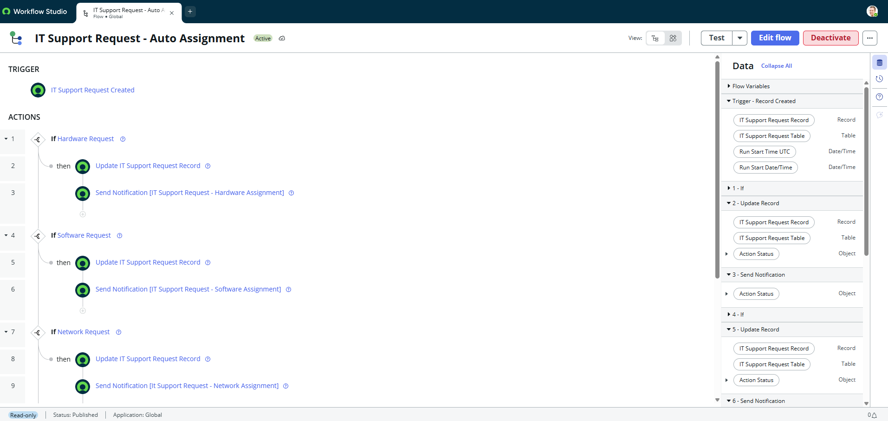
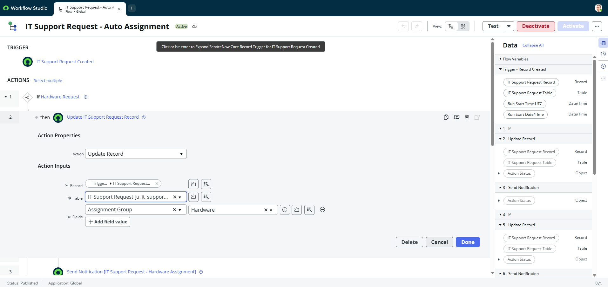
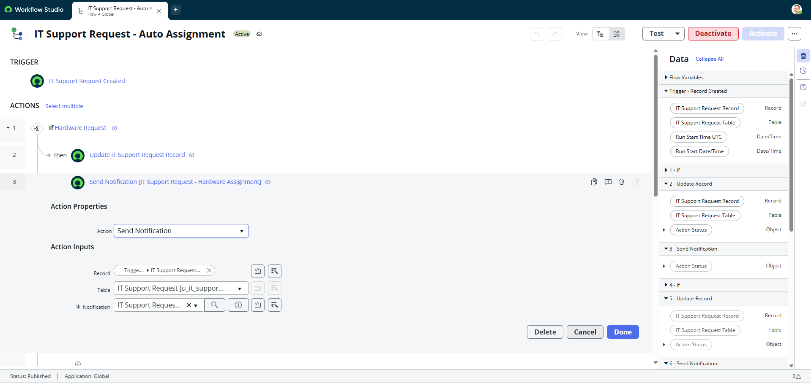
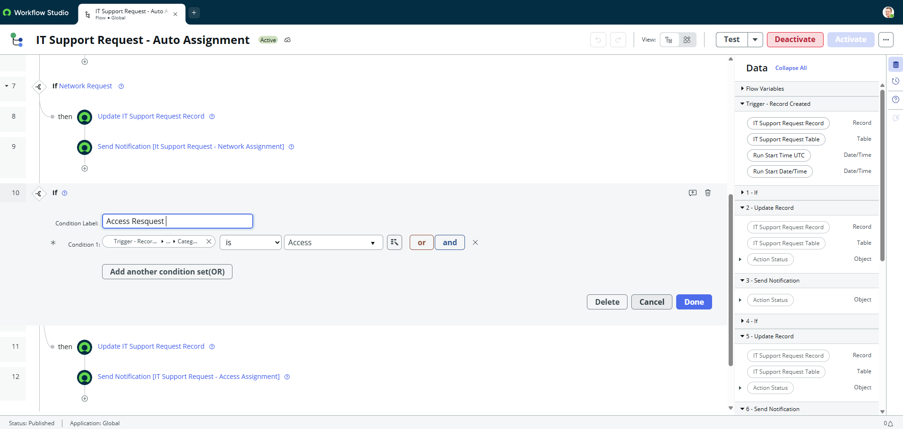
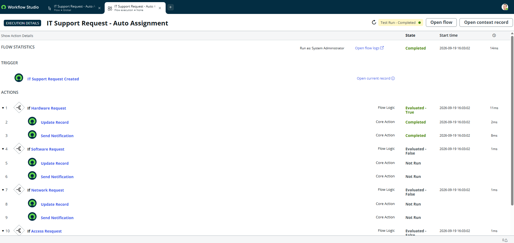

# ServiceNow - IT Support Request Automation

## About the Project

This is a ServiceNow project created in a Personal Developer Instance (PDI).

I used **Flow Designer** to automate IT support requests.

The project automatically assigns a request to the correct group based on the request category.

## Objective

The main goal of this project is to automate the assignment of IT support requests.

When a new request is created, the Flow checks the category and assigns the request to the correct group.

## How It Works

The Flow starts when a new **IT Support Request** is created.

The Flow checks the request category:

* **Hardware** → Hardware group
* **Software** → Software group
* **Network** → Network group
* **Access** → Access group

After the assignment, the Flow sends a notification.

## ServiceNow Features Used

* Flow Designer
* Record Created Trigger
* If conditions
* Update Record
* Send Notification
* Assignment Groups
* Custom Table
* Flow Test

## Custom Table

The project uses a custom table:

`u_it_support_request`

The table is used to store the IT support requests.

## Test

I tested the Flow with a **Hardware** request.

The test result was:

* **Test Run:** Completed
* **Hardware:** Evaluated - True
* **Update Record:** Completed
* **Send Notification:** Completed
* **Software:** Evaluated - False
* **Network:** Evaluated - False
* **Access:** Evaluated - False

The test showed that the Flow correctly identified the Hardware request and executed the correct actions.

## Screenshots

### Flow Overview

### Hardware Assignment

### Hardware Notification

### Access Condition

### Test Execution

## What I Learned

In this project, I practiced:

* Creating a custom table
* Creating a Flow with Flow Designer
* Using conditions
* Updating records
* Using Assignment Groups
* Sending notifications
* Testing a Flow
* Understanding basic automation in ServiceNow

## About Me

This project is part of my practical learning journey in ServiceNow after completing the **ServiceNow Certified System Administrator (CSA)** certification.

My goal is to continue learning ServiceNow and build practical projects.

